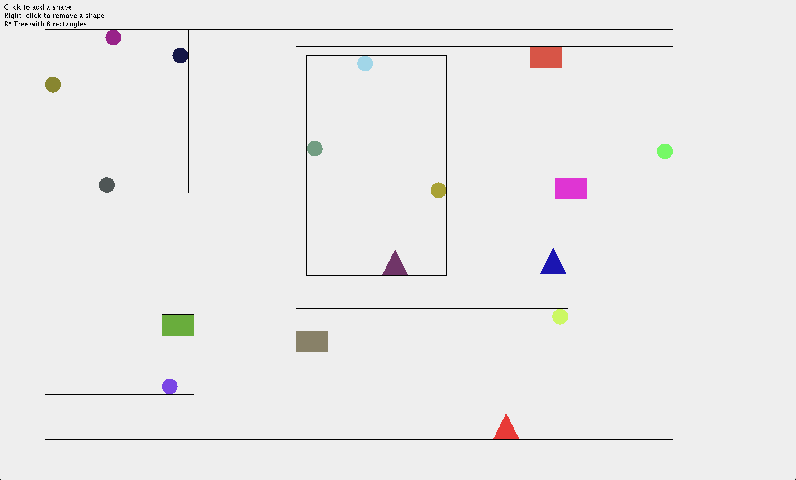

# R\*-Tree Implementation in Kotlin

A 2-dimensional implementation of the R\*-tree spatial data structure in Kotlin. I also added an
interactive visualization GUI because I like pretty things and wanted to show my friends.

## Visualization




## Overview

The R\*-tree is a spatial data structure optimized for indexing objects using their _Minimum
Bounding Rectangle_ (MBR). This implementation tries to be fairly close to the original algorithm
while keeping the code readable and easy to follow.

### Purpose

I built this project mainly as a learning resource and because I think R\*-trees are pretty cool and
wanted to implement one :). While it _should_ be functional, keep in mind it is not optimized for
production use.

## Features

- **Complete R\*-tree Implementation**: Full support for insertion, deletion, and spatial queries
- **Optimized Node Management**: Advanced splitting algorithms and forced reinsertion for better
  tree balance
- **Interactive Visualization**: Swing-based GUI for real-time tree visualization and interaction
- **Generic Type Support**: Store any type of data with associated spatial boundaries
- **"Comprehensive" Search Operations**:
    - Rectangle intersection queries
    - Point-based searches

### Try it yourself

```bash
# Clone the repository
git clone https://github.com/theiha/RStarTree.git
cd RStarTree

# Build the project
./gradlew build

# Run the interactive visualization demo
./gradlew run
```

### Usage

```kotlin
// 1. Create a new R*-tree to store some String IDs
val tree = RStarTree<String>()

// 2. Define some spatial objects (circles, rectangles, etc.)
val circle = Circle(centerX = 0, centerY = 5, radius = 5)
val circleId = "Circle-1"

val directRectangle = MinimumBoundingRectangle(Point(10.0, 10.0), width = 5.0, height = 5.0)
val directRectangleId = "Direct-Rect"

// 3. Insert them into the tree
tree.insert(circleId, circle.getMBR())
tree.insert(directRectangleId, directRectangle)

// 4. Perform an intersection search
val searchArea = MinimumBoundingRectangle(Point(7.0, 7.0), width = 10.0, height = 10.0)
val intersectionResults = tree.search(searchArea)
println("\nSearching for objects intersecting with: $searchArea")
println("Found intersecting objects: $intersectionResults")

// 5. Perform a point search
val searchPoint = Point(5.0, 5.0)
val pointResults = tree.search(searchPoint)
println("\nSearching for objects intersecting point: $searchPoint")
println("Found objects at point: $pointResults")

// 6. Remove an object
tree.remove(directRectangleId, directRectangle)

// 7. Check if it's actually gone
val finalSearchAreaResults = tree.search(searchArea)
println("\nSearching for objects intersecting with: $searchArea")
println("Found intersecting objects after removal: $finalSearchAreaResults")

val finalPointResults = tree.search(searchPoint)
println("\nSearching for objects intersecting point: $searchPoint")
println("Found intersecting objects after removal: $finalPointResults")
```

## Configuration

The R\*-tree can be tweaked with the following parameters:

- `maxEntriesPerNode` (default: 5): Maximum number of entries per node. Higher values can improve
  query performance but may increase insertion time.
- `minEntriesPerNode` (default: 1): Minimum number of entries per node. Should be roughly 40% of
  maxEntriesPerNode for optimal performance.
- `pReinsert` (default: 35% of max entries): Number of entries to reinsert during overflow
  treatment. This is a key parameter for tree quality.

```kotlin
// Create an R*-tree with custom parameters
val customTree = RStarTree<String>(
    maxEntriesPerNode = 8,
    minEntriesPerNode = 2,
    pReinsert = 3
)
```

## Potential Future Enhancements

Things I might add if I have a sudden burst of motivation:

- [ ] K-nearest neighbor search
- [ ] Bulk loading operations
- [ ] N-dimensional spatial indexing support (currently 2D only)
- [ ] Performance benchmarks
- [ ] Improvements in the interactive demo

## References and Further Reading

I definetely recommend checking out the following if you're interested in learning more about
R\*-trees:

- [R\*-tree: An Efficient and Robust Access Method (Original Paper)](https://infolab.usc.edu/csci599/Fall2001/paper/rstar-tree.pdf) -
  Beckmann et al., 1990
- [R-tree on Wikipedia](https://en.wikipedia.org/wiki/R-tree) - General overview of R-tree family
- [Spatial Data Structures Overview](https://dl.acm.org/doi/pdf/10.1145/971697.602266) -
  Comprehensive survey of spatial indexing

## Contributions

Feel free to contribute to this project! Although I can't promise I'll very active in this
repository, I'll definitely have a look when I'm not busy doing other cool stuff :)